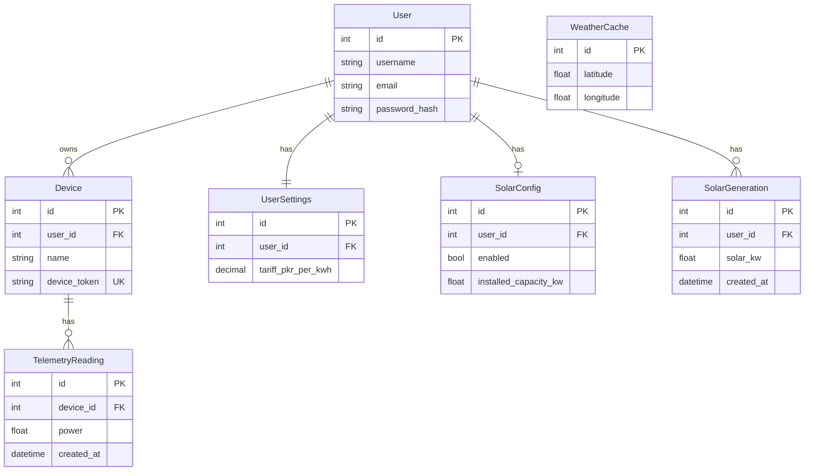

# SHEMS — Database summary (for FYP report)

This document describes **what is stored in the database** and **how tables relate**. SHEMS uses **Django ORM**; the default development database is **SQLite** (`shems-backend/db.sqlite3`). PostgreSQL can be enabled in `config/settings.py` without changing the models.

---

## 1. Overview

| Item | Detail |
|------|--------|
| **DB engine (current)** | SQLite 3 |
| **DB file (default)** | `shems-backend/db.sqlite3` |
| **ORM** | Django models → automatic table names `appname_modelname` |
| **Users** | Django built-in `User` model → table **`auth_user`** |
| **ML model** | **Not** in the database; file `shems-backend/models/predictor.joblib` |

---

## 2. Entity relationship (conceptual)



*Note:* `WeatherCache` is keyed by **latitude/longitude** only (no `user_id`); the solar service looks up rows by location when estimating generation.

---

## 3. Tables and columns (report-ready)

### 3.1 `auth_user` (Django — not in project `models.py`)

Standard Django user: **username**, **password** (hashed), **email**, **first_name**, **last_name**, **is_active**, **is_staff**, **date_joined**, etc.  
All app data for a household is scoped by **`user_id`** through foreign keys.

---

### 3.2 `devices_device`

| Column | Type (conceptual) | Notes |
|--------|-------------------|--------|
| `id` | integer, PK | Auto |
| `user_id` | integer, FK → `auth_user.id` | CASCADE on user delete |
| `name` | string (max 100) | Display name |
| `room` | string (max 100) | Optional |
| `device_type` | string (max 50) | e.g. meter type |
| `is_controllable` | boolean | Default false |
| `relay_on` | boolean | Intended load ON/OFF for ESP32 |
| `power_limit_w` | float, nullable | Optional cap |
| `daily_energy_limit_kwh` | float, nullable | Optional daily cap |
| `schedule_enabled` | boolean | Default false |
| `schedule_on_time` | time, nullable | Window start |
| `schedule_off_time` | time, nullable | Window end |
| `device_token` | string (max 64), **unique** | Auth for uploads / state API |
| `created_at` | datetime | Auto on create |

**Relationship:** Many devices per user. Deleting a user deletes their devices.

---

### 3.3 `telemetry_telemetryreading`

| Column | Type (conceptual) | Notes |
|--------|-------------------|--------|
| `id` | integer, PK | Auto |
| `device_id` | integer, FK → `devices_device.id` | CASCADE on device delete |
| `voltage` | float | Volts |
| `current` | float | Amperes |
| `power` | float | Watts (instant / average for that sample) |
| `energy_kwh` | float | Cumulative meter reading (kWh) |
| `created_at` | datetime | Reading timestamp (bulk import can set past times) |

**Index:** `(device_id, created_at DESC)` — speeds up “latest” and range queries per device.

**Relationship:** Many readings per device. Cost and monthly reports use **positive deltas** between consecutive `energy_kwh` values.

---

### 3.4 `user_settings_usersettings`

| Column | Type (conceptual) | Notes |
|--------|-------------------|--------|
| `id` | integer, PK | Auto |
| `user_id` | integer, FK → `auth_user.id`, **unique** | One row per user |
| `tariff_pkr_per_kwh` | decimal(8,2) | User’s tariff for cost display |
| `updated_at` | datetime | Auto on save |

---

### 3.5 `solar_solarconfig`

| Column | Type (conceptual) | Notes |
|--------|-------------------|--------|
| `id` | integer, PK | Auto |
| `user_id` | integer, FK → `auth_user.id`, **unique** | One config per user |
| `enabled` | boolean | Default false |
| `installed_capacity_kw` | float | Default 0 |
| `latitude` | float, nullable | For weather |
| `longitude` | float, nullable | For weather |
| `created_at` | datetime | Auto |
| `updated_at` | datetime | Auto |

---

### 3.6 `solar_weathercache`

| Column | Type (conceptual) | Notes |
|--------|-------------------|--------|
| `id` | integer, PK | Auto |
| `latitude` | float | Cache key with longitude |
| `longitude` | float | |
| `cloud_cover` | integer | Percentage |
| `sunrise` | datetime | |
| `sunset` | datetime | |
| `fetched_at` | datetime | Refreshed when API is called |

**Note:** Not a direct FK to `User`; looked up by coordinates when estimating solar.

---

### 3.7 `solar_solargeneration`

| Column | Type (conceptual) | Notes |
|--------|-------------------|--------|
| `id` | integer, PK | Auto |
| `user_id` | integer, FK → `auth_user.id` | CASCADE |
| `solar_kw` | float | Estimated solar at sample time |
| `home_kw` | float | Home load |
| `grid_import_kw` | float | max(home − solar, 0) |
| `cloud_cover` | integer | Snapshot |
| `created_at` | datetime | Auto |

**Index:** `(user_id, created_at DESC)` — history charts.

---

## 4. Other Django tables (short mention for report)

Django also creates tables such as **`django_migrations`** (schema version history), and may use **`django_session`** if sessions are enabled. These are **framework** tables, not business logic entities.

---

## 5. Data isolation (security note for report)

Every query for devices, telemetry, settings, and solar history is filtered by **`request.user`**. Users cannot read another user’s rows by ID through the normal API.

---

## 6. How to inspect the live schema

From `shems-backend`:

```bash
python manage.py inspectdb
```

Or open `db.sqlite3` with **DB Browser for SQLite** and export a diagram or table list for the report appendix.

---

*Aligned with models in: `devices/models.py`, `telemetry/models.py`, `user_settings/models.py`, `solar/models.py`.*
