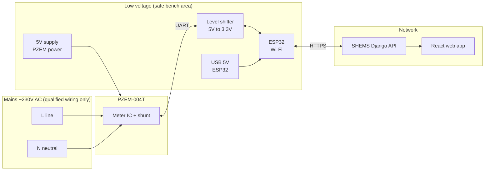

# SHEMS — Hardware & circuit guide (ESP32 + PZEM-004T)

This matches what the **SHEMS** codebase expects: **ESP32** uploads telemetry with **`X-DEVICE-TOKEN`**, and the UI mentions **PZEM-004T**. Use this as a **shopping and wiring reference** for your FYP report and build.

---

## ⚠️ Safety (read first)

- **Mains voltage (~230 V AC) can kill or cause fire.** Only work on de-energized circuits if you are not qualified, or have work done by a **licensed electrician**.
- This document is **educational**. You are responsible for complying with **local electrical codes** and **university lab rules**.
- Prefer **isolated enclosures**, **correct cable ratings**, **RCD/GFCI** protection, and **fuse** or **MCB** on the circuit you monitor.
- **Never** put ESP32 or low-voltage wiring inside the mains enclosure without proper **clearance, strain relief, and separation** from live parts.

---

## 1. Suggested bill of materials (one monitoring node)

| Item | Role | Notes |
|------|------|--------|
| **ESP32** dev board (e.g. ESP32-WROOM-32) | Wi‑Fi, UART to PZEM, HTTP to Django API | 3.3 V logic; USB power for bench |
| **PZEM-004T** (v3.0 / UART model) | V, I, P, kWh over single phase | Fits ~80–260 V AC; 5 V DC supply pin |
| **5 V supply** for PZEM | Powers the module | Often from a **small 5 V adapter** or DC‑DC from a safe low-voltage supply—**not** tapped from mains unless you know how to do that safely |
| **Level shifter** (5 V ↔ 3.3 V) or **resistor divider** | PZEM UART is often **5 V TTL**; ESP32 GPIO is **3.3 V** | At minimum: **PZEM TX → divider → ESP32 RX** |
| **Dupont wires**, **stripboard** optional | Prototyping | Keep mains and LV wiring **separate** |
| **Enclosure** | Mechanical + safety | IP rating if used in humid areas |
| **Optional: relay module** (3.3 V / 5 V coil, **low-voltage control**) | Matches app **relay_on** / schedule idea | For **real load switching**, use a **contactor** or **proper relay rated for your load**, wired by someone qualified—do not switch heavy AC with a bare 5 V relay module on a breadboard |

---

## 2. Block diagram (system view — for report)

```
                    ┌─────────────────────────────────────────┐
   MAINS ~230 V AC   │  PZEM-004T (energy meter module)        │
   L, N ────────────►│  • Voltage sense                       │
                     │  • Current (load current through unit) │
                     │  • UART TX/RX (9600 baud typical)        │
                     │  • 5 V DC power                         │
                     └───────────┬─────────────────────────────┘
                                 │ UART (use level shift)
                                 ▼
                     ┌───────────────────────┐
                     │  ESP32                 │
                     │  • Wi‑Fi → SHEMS API   │
                     │  • POST telemetry      │
                     │  • GET state-by-token  │
                     └───────────┬────────────┘
                                 │ USB 5 V or external 3.3/5 V
                                 ▼
                     ┌───────────────────────┐
                     │  Laptop / phone        │
                     │  (Django + React UI)   │
                     └───────────────────────┘
```

---

## 3. PZEM-004T ↔ ESP32 (signal side only)

Typical **logical** connections (pin names vary by board—check your PZEM silkscreen):

| PZEM-004T | To ESP32 | Note |
|-----------|----------|------|
| **5V** | Regulated **5 V** supply | Common ground with ESP32 if sharing supply |
| **GND** | **GND** | Star ground; keep leads short |
| **TX** (PZEM sends) | **RX** (GPIO) via **level shift** or divider | PZEM → ESP32 direction |
| **RX** (PZEM receives) | **TX** (GPIO) via level shifter | Some code only reads; optional |

**Baud rate:** Often **9600** (confirm in your PZEM datasheet / library).

**Do not** connect PZEM UART directly to a PC USB‑serial adapter for long tests while the PZEM is on mains unless you understand **isolation**—prefer ESP32 on the bench with a **safe** test setup.

---

## 4. Mains side (conceptual — electrician detail)

The **PZEM-004T** is designed to sit in the **line path** according to the manufacturer diagram:

- **Neutral** reference and **line** voltage sense: follow the **official PZEM wiring diagram** for your exact revision.
- **Load** (e.g. AC, PC circuit, fan) is connected so that **load current** flows through the module’s **current path** as specified.

For a **demo in the lab**, many teams use:

- An **isolation transformer** + **limited current** test load, or  
- A **pre-built energy-monitoring socket** product, if allowed.

Document in your report: **single-phase Pakistan ~230 V**, **one monitored branch per PZEM**, three devices in the app can mean **three PZEM nodes** or **one node + synthetic** for other loads.

---

## 5. Firmware / API alignment (software group)

- **Upload:** `POST` to your backend telemetry endpoint with header **`X-DEVICE-TOKEN:`** (paste token from Devices page) and JSON body matching `telemetry/views.py` expectations (voltage, current, power, energy_kwh, etc.).
- **Control:** `GET /api/devices/state-by-token/` returns **`relay_on`**, limits, schedule—your firmware can poll and drive a **relay GPIO** if you add that hardware.

---

## 6. Report checklist

- [ ] Block diagram (system + optional relay path)  
- [ ] Table of components with part numbers if fixed  
- [ ] Photo of **safe** prototype (enclosure closed if mains inside)  
- [ ] One paragraph on **security**: device token vs user JWT  
- [ ] **Safety** paragraph and compliance with lab rules  

---

## 7. Diagram for slides / report (Mermaid)

Paste into [Mermaid Live](https://mermaid.live) and export **PNG** or **SVG** for Word/LaTeX.



---

## 8. Optional: one-line schematic (UART only)

```
     PZEM-004T                    ESP32
    +---------+                  +-----------+
    | 5V  o---+--- 5V rail      | 3V3       |
    | GND o---+--- common GND --+ GND       |
    | TX  o---+---[ level ]-----+ GPIO RX   |
    | RX  o---+---[ shifter ]---+ GPIO TX   |
    +---------+                  +-----------+
```

Use a **bidirectional** level shifter module for TX/RX if you talk both ways; for **read-only**, a **voltage divider** on PZEM TX → ESP32 RX is common (e.g. 1k / 2k divider from 5 V → ~3.3 V)—verify with a multimeter before powering ESP32.
